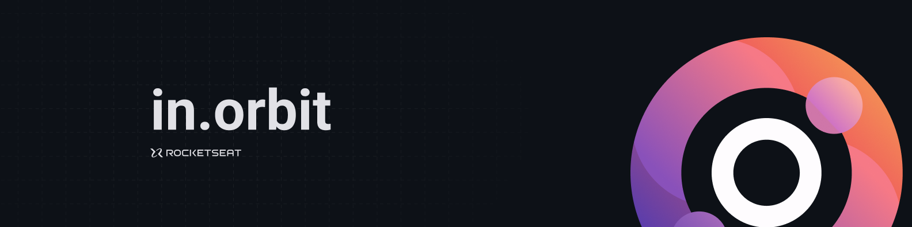
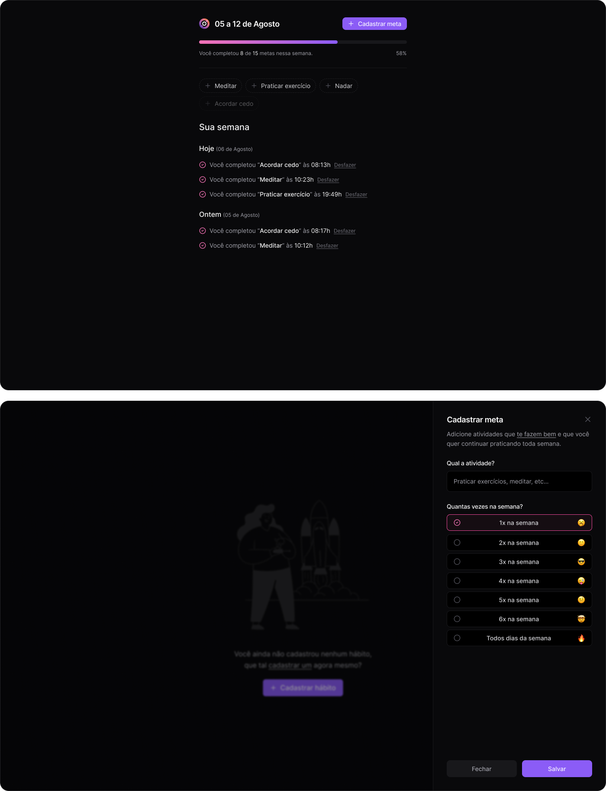

  

  
  <a aria-label="Completed" href="https://rocketseat.com.br/">
    </img>

## :speech_balloon: Visão Geral

Esse projeto foi construído durante o NLW Pocket: Javascript da [Rocketseat](www.rocketseat.com.br) e teve como objetivo desenvolver uma aplicação para cadastro de metas a serem alcançadas durante a semana.

## :camera: Preview

  

### :sparkles: Funcionalidades

- Cadastro e visualização de metas semanais
- Marcação de metas como conluídas

A seguir, alguns dos aprendizados/conceitos postos em prática durante o desenvolvimento:

**Front-End**:
- Funtamentos de Javascript com React
- Estilização com TailwindCSS
- Consumo de APIs com uso do React Query

**Back-End**:
- Criação de API com Fastify
- Validação de dados com Zod
- Utilização do Drizzle ORM
- Desenvolvimento de queries SQL para consultas em banco PostgreSQL
  

## :rocket: Tecnologias Utilizadas

  
  
  
    
    
  
  
  
  
 

 

  Feito com :purple_heart:

